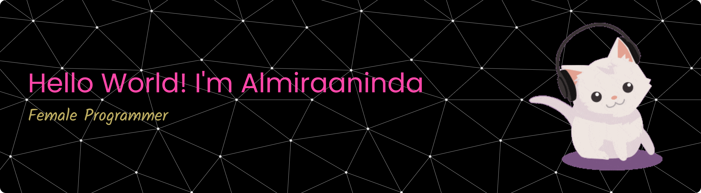

<!-- ## Hello World! I'm Almiraaninda 👋 -->

<!-- - 🔭 I’m currently working on **@wpucourse**
- 🌱 I’m currently learning [**Laravel**](https://laravel.com) Framework
- 🌷🌷🌷🌷

##### Skills

##### Connect with Me
    

##### My GitHub Stats

 -->

### Hello World! I'm Almiraaninda 👋

##### 🌐 Socials:

   

##### 💻 Tech Stack:

           

##### 📊 GitHub Stats:

 
 

##### 🏆 GitHub Trophies

##### 🔝 Top Contributed Repo

---

<!-- Proudly created with GPRM ( https://gprm.itsvg.in ) -->